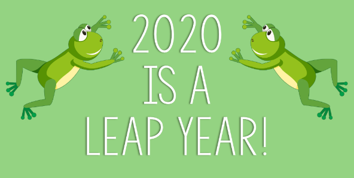

<span style="display:block;text-align:center">

</span>
<span style="display:block;text-align:center"><font color="grey">Source: </font>adopted from <a href="https://cougardaily.org/wp-content/uploads/2020/02/leap-year.png">here</a></span>


## Introduction
Year 2020 is a leap year. The algorithm to determine whether a year is leap year is as follows:

!!! quote "Definition of Leap Year"
    Every year that is exactly divisible by four is a leap year, except for years that are exactly divisible by 100, but these centurial years are leap years if they are exactly divisible by 400.

For example, the years 1800 and 1900 were not leap years, but the years 2000 and 2020 were.


## Question
Write a function ``isLeapYear`` to determine whether a given year is leap year.

```q
isLeapYear 1800 / 0b
isLeapYear 1900 / 0b
isLeapYear 2000 / 1b
isLeapYear 2020 / 1b
```
