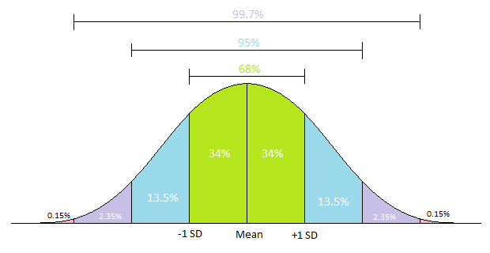

<span style="display:block;text-align:center">

</span>
<span style="display:block;text-align:center"><font color="grey">Source: </font>adopted from <a href="https://www.biologyforlife.com/uploads/2/2/3/9/22392738/sd2_orig.png">here</a></span>


## Introduction
In a standard report on the performance of algo parent orders, the notional weighted average slippage is typically reported. It is fairly simple to calculate weighted average in q using the built-in function ``wavg``. To be consistent, we should also report the notional weighted standard deviation of slippage. Here is the definition of [weighted standard deviation](https://www.itl.nist.gov/div898/software/dataplot/refman2/ch2/weightsd.pdf).


## Question
The function ``simSlippage`` simulates the notional and slippage of ``10,000`` orders.

```q
simSlippage:{
    n:10000;

    system "S -314159";
    slippage:5-0.01*n?1000;

    system "S -314159";
    notional:10000+n?100000;

    ([] notional:notional;slippage:slippage)
  };
perfData:simSlippage[];
```

Write a function in q to calculate the notional weighted standard deviation of these ``10,000`` orders using the formula provided above.
