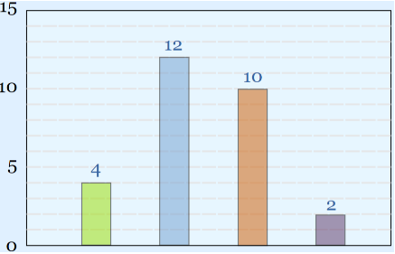

Source: adopted from <a href="https://www.mathsisfun.com/data/images/bar-chart-example.svg">here</a>

## Introduction
Let's go one step further by continuing the question from last week. A question asked by algorithmic traders
quite often is how many open orders are live on market at any given time.

## Question
Find the time series of the number of open child orders. The question from last week is simply a special case
of this question. The output is a table with two columns like below:

|  startTime   | nOpenOrders |
|:------------:|:-----------:|
| 09:30:00.000 |      0      |
| hh:mm:ss.SSS |      x      |
| hh:mm:ss.SSS |      y      |
| hh:mm:ss.SSS |      z      |
