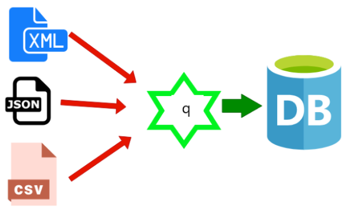

<span style="display:block;text-align:center">

</span>


## Introduction
I/O operation is one of the most common features supported by all programming languages. Reading from and writing to a file in ``q`` is extremely powerful and flexible. Reading a standard csv is quite straightforward and is covered extensively in ``Q For Mortals``. However, the files we have to read sometimes are not standard and some pre-processing is required before they are loaded into kdb.


## Question
NASDAQ publishes the listed symbols on its exchange on a daily basis. The link to this text file is [here](ftp://ftp.nasdaqtrader.com/symboldirectory/nasdaqlisted.txt). Click the link to download and save the file on your personal computer. The file you downloaded has a header and footer. For example

**Header**

``Symbol|Security Name|Market Category|Test Issue|Financial Status|Round Lot Size|ETF|NextShares``

**Footer**

``File Creation Time: 0316202018:01|||||||``

Write a q script snippet to load this text file into kdb table ``nasdaqlisted`` with the following schema:

```q
q) meta nasdaqlisted
| c              | t f a |
|----------------|-------|
| symbol         | s     |
| securityName   | s     |
| marketCategory | s     |
| isTestIssue    | b     |
| lotSize        | j     |
| isETF          | b     |
```
