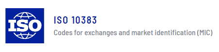

# National Best Bid and Offer

<span style="display:block;text-align:center">

</span>
<span style="display:block;text-align:center"><font color="grey">Source: </font>adopted from <a href="https://www.iso20022.org/market-identifier-codes">here</a></span>


## Introduction
Market Identifier Code (MIC) is an international standard, which "specifies a universal method of identifying exchanges, trading platforms, regulated or non-regulated markets and trade reporting facilities as sources of prices and related information in order to facilitate automated processing" as quoted from its [official site][mic_site].

The U.S. Equities market has 13 lit exchanges and dozens of Alternative Trading Systems (ATSs), *a.k.a.* dark pools. Many buy side firms also operate their own non-ATS crossing systems.


## Question
There might be multiple exchanges quoting at the National Best Bid and Offer (NBBO) price level at any given time. It is assumed that child orders are always placed at NBBO and can be placed to any lit exchanges. The below function ``simChildOrders`` simulates some **BUY** orders with execution destination (``exDest``). See the definition of FIX tag for [exDest][fix_exDest]. It also has a column ``nbbExchanges``, which shows the list of lit exchanges that are present at the best bid price level.

```q
simChildOrders:{[nOrders]
    seed:-314159;
    openTime:`time$09:30;
    closeTime:`time$16:00;
    litVenues:`XNYS`ARCX`XCHI`XASE`XCIS`XNAS`XBOS`XPHL`BATS`BATY`EDGA`EDGX`IEXG;

    system "S ",string seed;
    submitTimes:asc closeTime&openTime+nOrders?390*60*1000;

    system "S ",string seed;
    exDest:nOrders?litVenues;

    system "S ",string seed;
    nExchanges:3+nOrders?(count litVenues)-3;
    system "S ",string seed;
    nbbVenues:{y?x}[litVenues;] each nExchanges;

    ([] time:submitTimes;side:`BUY;exDest:exDest;nbbVenues:nbbVenues)
  };

childOrders:simChildOrders[5000];
```

Find the number of orders which are placed to exchanges present at NBB (National Best Bid).

[mic_site]: https://www.iso20022.org/market-identifier-codes
[fix_exDest]: https://fiximate.fixtrading.org/en/FIX.5.0SP2_EP255/tag100.html
