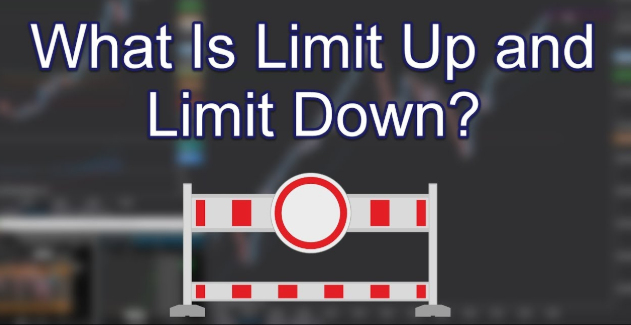

# Limit Up Limit Down

<span style="display:block;text-align:center">

</span>
<span style="display:block;text-align:center"><font color="grey">Source: </font>adopted from <a href="https://slingshotfutures.com/2019/01/14/what-is-limit-up-and-limit-down-www-slingshotfutures-com/">here</a></span>


## Introduction
March 2020 is definitely unprecedented in the history of financial markets. Both market volume and volatility heightened during this [2020 stock market crash][2020_crash]. The market wide circuit breaker was triggered four times in 10 days (Mar 9, 12, 16 and 18) and thousands of individual stocks had circuit breaker activated. There is no respite in sight for this volatility.

The Limit Up Limit Down (LULD) was designed to replace the single stock circuit breaker. A stock enters a *Limit State* if its price deviation from previous close exceeds a certain percentage, which depends on the price of the stock. For Tier 1 securities, the threshold percentage from market open auction to 3:35pm is as follows:

| Price Range                        |    Price Band Percentage    |
|:-----------------------------------|:---------------------------:|
| strictly greater than 3.0          |             5%              |
| [0.75, 3.0] inclusive on both side |             20%             |
| strictly less than 0.75            | The lesser of $0.15 and 75% |

For more details about LULD, see [Nasdaq LULD FAQ][NasdaqFAQ].


## Question
Write a q function ``calculateLULD`` to calculate the LULD prices for a single price or list of prices. This function returns a list and each element of the list is a two-element list which has first element as the limit up price and the second element as the limit down price. For example,

```q
calculateLULD 3            / enlist 3.6 2.4
calculateLULD 3 10         / (3.6 2.4;10.5 9.5)
calculateLULD 0.1 0.5 3 10 / (0.175 0.025;0.65 0.35;3.6 2.4;10.5 9.5)
```

[2020_crash]: https://en.wikipedia.org/wiki/2020_stock_market_crash
[NasdaqFAQ]: https://www.nasdaqtrader.com/content/MarketRegulation/LULD_FAQ.pdf
