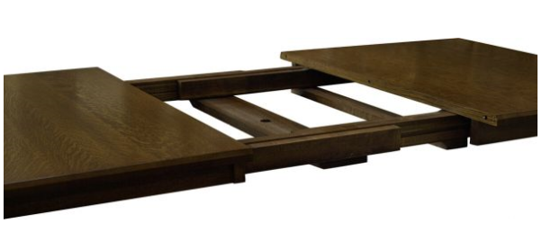

<span style="display:block;text-align:center">

</span>
<span style="display:block;text-align:center"><font color="grey">Source: </font>adopted from <a href="https://www.countrysideamishfurniture.com/media/made/media/uploads/Blog/Wood_Slides_601_205_80.jpg">here</a></span>


## Introduction
The famous [NYSE TAQ][NYSE_TAQ] data provides trades and quotes on a T+1 basis. Every algorithmic trading quant in U.S. equities should be familiar with this data set. NYSE also provides data specifications and some sample data so that unsubscribed users can get a flavor of what the data offers. This data is also available to students if your school offers access to [Wharton Business School Dataset][WRDS].

Thanks to the advocate of data transparency by FINRA, more and more information about dark pools in the United States is disclosed over the last five years. Some data on ATS and non-ATS is release [here][FINRA_ATS]. FINRA releases weekly aggregated ATS and non-ATS data by symbol and venue. This provides a historical liquidity distribution among all off-market trading venues. All the off-market trades are reported to SIP (Securities Information Processor), which is the data source for NYSE TAQ. In SIP, all off-market trades are marked with exchange ``D``.

## Question
From NYSE TAQ data, we can classify each off-market trade as one of the following three categories:

- AboveMidQuote
- AtMidQuote
- BelowMidQuote

For a given stock ``ABCD``, it is assumed that the distribution of volume among the three price levels are shown in table ``proportionByPriceLevel``, and the volume traded on each venues are given in table ``atsVolume``. For simplicity, only 3 ATS venues are included in this question.

```q
portions:([]
  priceLevel:`AboveMidQuote`AtMidQuote`BelowMidQuote;
  portion:0.2 0.5 0.3
);
atsVolume:([]
  venue:`CROS`JPMX`MSPL;
  qty:384818 130987 177100
);
```

Let's assume the volume traded on each venue follows the same distribution dictated by ``proportionByPriceLevel``. Find the volume traded at each price level for each venue. The resulting table should have three columns and 9 rows. Your output should look like this:

| venue | priceLevel    | qtyAtPriceLevel |
|:-----:|---------------|-----------------|
| CROS  | AboveMidQuote | 76963.6         |
| CROS  | AtMidQuote    | 192409          |
| CROS  | BelowMidQuote | 115445.4        |
| JPMX  | AboveMidQuote | 26197.4         |
| JPMX  | AtMidQuote    | 65493.5         |
| JPMX  | BelowMidQuote | 39296.1         |
| MSPL  | AboveMidQuote | 35420           |
| MSPL  | AtMidQuote    | 88550           |
| MSPL  | BelowMidQuote | 53130           |

[NYSE_TAQ]: https://www.nyse.com/market-data/historical/daily-taq
[WRDS]: https://wrds-www.wharton.upenn.edu/documents/1301/NYSE_TAQ_PRINT.pdf
[FINRA_ATS]: https://otctransparency.finra.org/otctransparency/
