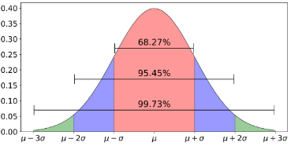

# Random Normal Number

<span style="display:block;text-align:center">

</span>
<span style="display:block;text-align:center"><font color="grey">Source: </font>adopted from <a href="https://miro.medium.com/max/1400/1*IZ2II2HYKeoMrdLU5jW6Dw.png">here</a></span>


## Introduction
Normal distribution is one of the most common distributions in statistics. Drawing one or multiple random numbers from a normal distribution is an often used technique in Monte Carlo simulation. Generating a random normal number is implemented in most programming languages. One algorithm used to generate a standard normal random number is [Box-Muller transformation][BoxMuller], which generates a pair of random numbers from a standard normal distribution.

**Box-Muller Algorithm**

!!! example "Algorithm"
    1. $a:=\sqrt{-2 \cdot ln(U_1)}$
    1. $b:=2 \pi \cdot U_2$
    1. return [$a \cdot sin(b)$, $a \cdot cos(b)$]

    where $U_1$ and $U_2$ are two independent uniform random variables.

## Question
Write a q function to generate a list of random numbers from a standard normal distribution.

```q
genNormalNumber[5] / Returns a list of 5 normal random numbers
```

[BoxMuller]: https://mathworld.wolfram.com/Box-MullerTransformation.html
