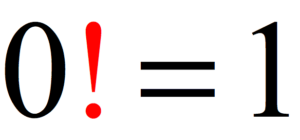

# Factorial

Source: adopted from <a href="https://www.chilimath.com/wp-content/uploads/2019/08/zero-factorial-300x140.png">here</a>

## Introduction
Factorial is one of most common mathematical concepts, which is the product of all positive integers less than or equal to $n$. It is denoted mathematically as,

$$n! = n \times (n-1) \times (n-2) \times \cdot\cdot\cdot \times 1$$

This is commonly seen in combinations and permutations or Taylor series.

## Question
Implement a function ``factorial`` to calculate the factorial of a given integer. Return zero if the input integer is negative. Try your best to provide multiple implementations.
