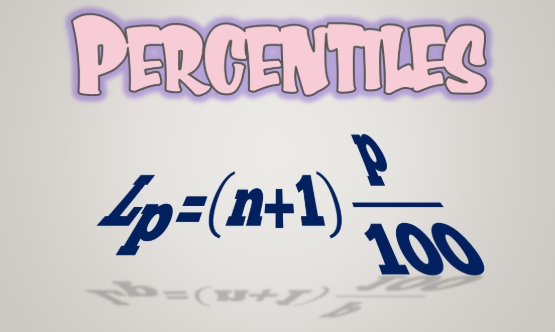

Source: adopted from <a href="https://i.ytimg.com/vi/tXGcs02y9r4/maxresdefault.jpg">here</a>

## Introduction

!!! quote "Quote from Wiki"
    A percentile (or a centile) is a measure used in statistics indicating the value below which a given percentage of observations in a group of observations falls. For example, the $20^{th}$ percentile is the value (or score) below which 20% of the observations may be found. Equivalently, 80% of the observations are found above the $20^{th}$ percentile.

## Question
Write a q function ``calcPercentile[p;v]`` to calculate the percentiles of a list of numbers. This function has two arguments:

- ``p``: an atom or a list of float numbers for percentiles, which is between 0 and 1.
- ``v``: a list of numerical numbers, either float or integers.
