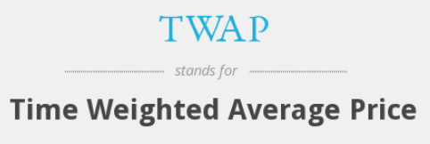

# Time Weighted Average Price

<span style="display:block;text-align:center">

</span>
<span style="display:block;text-align:center"><font color="grey">Source: </font>adopted from <a href="https://www.abbreviations.com/images/1946550_TWAP.png">here</a></span>

## Introduction
Time weighted average price (TWAP) has two practical uses in algorithmic trading: one is the average price over a time period and the other is the trading algorithm which executes a given amount of shares *evenly* within a given time period. This question focuses on the first use case.

Assuming the trade price time series is

$$p_0,\cdots,p_{i-3},p_{i-2},p_{i-1},p_i,p_{i+1},p_{i+2},p_{i+3},\cdots$$

and the corresponding timestamps of these prices are

$$t_0,\cdots,t_{i-3},t_{i-2},t_{i-1},t_i,t_{i+1},t_{i+2},t_{i+3},\cdots$$

Mathematically, TWAP over a $\Delta t$ time period for trade $i$ is defined as:

$$
TWAP_{i;\Delta t} = \sum_{j=0}^{i-1} \frac{max(t_{i-j},t_i-\Delta t)-max(t_{i-j-1},t_i-\Delta t)}{\Delta t}\cdot p_{i-j-1}
$$

## Question
The function ``simTrade`` simulates the price and timestamp of each trade in the continuous trading session from ``09:30`` to ``16:00``.

```q
simTrade:{
  n:100000;
  system "S -314159";
  :([]time:asc 09:30+n?"n"$06:30;price:20+0.01*sums?[n?1.<0.5;-1;1]);
  };
trades:simTrade[];
```

Implement a function ``twap[trades;secs]`` to calculate the rolling TWAP for each tick of trade price. For example, ``twap[trades;300]`` calculates the rolling 5-minute TWAP price for each trade in the table.
