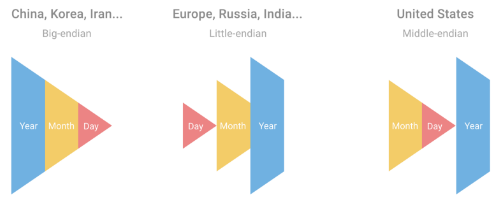

# Date Formatting

<span style="display:block;text-align:center">

</span>
<span style="display:block;text-align:center"><font color="grey">Source: </font>adopted from <a href="https://miro.medium.com/max/1000/1*-OWHNb_sgI29JR7BjO51jw.png">here</a></span>

## Introduction
Date format varies from country to country and every programming language provides one way or another to format a date object into a string of different formats. [Date format by country][DateFormat] gives a good summary of different format used in different countries and the [ISO 8601][ISO-8601] date format. 

## Question
Convert a date string of format ``yyyy.mm.dd`` to ``yyyymmdd``. Provide as many solutions as possible and compare the speed of all methods.

```q
s:string 2020.06.29; / Convert it to "20200629"
```

[DateFormat]: https://en.wikipedia.org/wiki/Date_format_by_country
[ISO-8601]: https://www.iso.org/iso-8601-date-and-time-format.html
