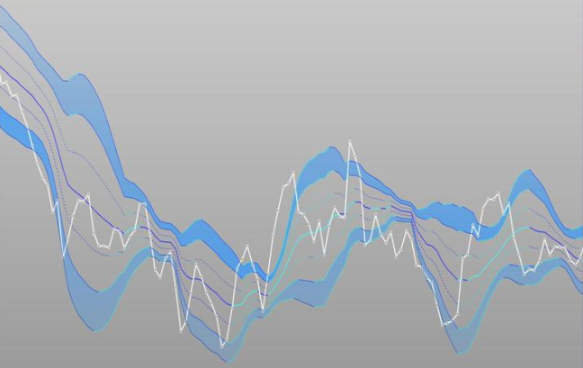

# Volume Weighted Average Price (n-tick)

<span style="display:block;text-align:center">

</span>
<span style="display:block;text-align:center"><font color="grey">Source: </font>adopted from <a href="https://www.prorealcode.com/wp-content/uploads/2016/03/vwap-did-1459157689pcl84.jpg">here</a></span>

## Introduction
The Volume Weighted Average Price (VWAP) is one of the most common benchmark prices in execution algorithms and rolling VWAP is one classical analytics in a Complex Event Processing (CEP) engine. The formula to calculate the VWAP of $N$ trades is as follows:

$$
VWAP = \frac{\sum_{i=1}^N p_i \cdot v_i}{\sum_{i=0}^N v_i}
$$

where $p_i$ and $v_i$ is the trade price and volume of $i^{th}$ trade, respectively.

The rolling *n*-tick VWAP price at tick $i$ is the VWAP of the previous $n$ trades, including the current trade $i$. Mathematically,

$$
VWAP_{[i;n]} = \frac{\sum_{j=i-n+1}^i p_j \cdot v_j}{\sum_{j=i-n+1}^i v_j}
$$

## Question

The function simTrade simulates the price and timestamp of each trade in the continuous trading session from 09:30 to 16:00.

```q
simTrade:{
  n:100000;
  system "S -314159";
  times:asc 09:30+n?"n"$06:30;
  syms:n?`AAPL`C`IBM;
  prices:20+0.01*sums?[n?1.<0.5;-1;1];
  sizes:n?10000;
  :([] time:times;sym:syms;price:prices;volume:sizes);
  };
trades:simTrade[];
```

Implement a function ``rollingVwap[trades;n]`` to calculate the rolling n-tick VWAP for each tick of trade price by symbol. For example, ``rollingVwap[trades;10]`` calculates the rolling 10-tick VWAP price for each trade in the table.
