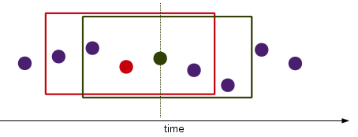

# Volume Weighted Average Price (time-window)

<span style="display:block;text-align:center">

</span>
<span style="display:block;text-align:center"><font color="grey">Source: </font>adopted from <a href="https://druedin.files.wordpress.com/2013/06/namav.png">here</a></span>

## Introduction
Last week, we discussed the *n*-tick rolling Volume Weighted Average Price (VWAP). We continue along this thread to calculate the time-window VWAP, *i.e.* the VWAP over a sliding window, say, 5 minutes.

The rolling time-window VWAP price at time $t$ is the VWAP of the previous trades within the time window $[t-w;t]$, including the current trade at time $t$. Mathematically,

$$
VWAP_{[t;w]} = \frac{\sum_{j \ge t-w}^t p_j \cdot v_j}{\sum_{j \ge t-w}^t v_j}
$$

## Question

The function ``simTrade`` simulates the price and timestamp of each trade in the continuous trading session from 09:30 to 16:00.

```q
simTrade:{
  n:100000;
  system "S -314159";
  times:asc 09:30+n?"n"$06:30;
  syms:n?`AAPL`C`IBM;
  prices:20+0.01*sums?[n?1.<0.5;-1;1];
  sizes:n?10000;
  :([] time:times;sym:syms;price:prices;volume:sizes);
  };
trades:simTrade[];
```

Implement a function ``rollingTimeWindowVwap[trades;w]`` to calculate the rolling time-window VWAP for each tick of trade price by symbol. For example, ``rollingTimeWindowVwap[trades;00:05]`` calculates the rolling 5-minute window VWAP price for each trade in the table.
