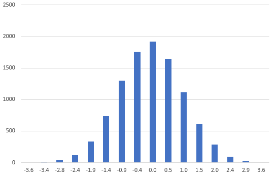

## Answer

The suggested answer is as follows.

```q
histogramSturges:{[data]
  // Calculate the total number of bins
  k:1+ceiling xlog[2;count data];
  
  // Find the min/max value of the list
  minVal:min data;
  maxVal:max data;
  
  // Find the lower bound of each bin interval
  bins:minVal+((maxVal-minVal)%k)*til 1+k;
  
  // Find the bin index of each data item
  binData:([] binIdx:bins binr data;data);

  // 1) Calculate the number of data points in each bin, and
  // 2) Compute the median value of all data points in each bin
  0!select binVal:med data,binCnt:count binIdx by binIdx from binData
  };
histogramSturges[data]
```

If you plot the above data, you will get something like below. This verifies that our normal random number generator works as expected.

<span style="display:block;text-align:center">

</span>
