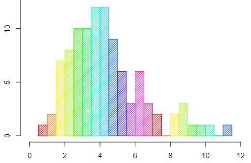

# Histogram

<span style="display:block;text-align:center">

</span>
<span style="display:block;text-align:center"><font color="grey">Source: </font>adopted from <a href="https://en.wikipedia.org/wiki/Histogram#/media/File:Histogram_of_arrivals_per_minute.svg">here</a></span>

## Introduction
Histogram is a graphical display of numerical data using bars of different heights and it is an approximate representation of the distribution of data. The height of each bar shows how many data points fall into each range and you decide the ranges to use. This allows the inspection of the data for its underlying distribution (*e.g.* normal distribution), outliers, skewness, etc.

There are a couple of different guidelines on how to calculate the number of bins for a histogram. For a summary of different guidelines, please see [Histogram][Histogram] on wiki page. Let's take a look at the Sturges' formula. 

The number of bins $k$ can be calculated from a suggested bin width $w$ as:

$$
k = \left\lceil \frac{max(x)-min(x)}{w} \right\rceil
$$

By Sturges' formula, $k$ can be calculated as:

$$
k = \left\lceil log_2n \right\rceil + 1
$$

where $n$ is the total number of data points used to calculate the histogram.

## Question

First, let's generate some random numbers:

```q
genNormalNumber:{
    pi:acos -1;
    $[x=2*n:x div 2;
      raze sqrt[-2*log n?1f]*/:(sin;cos)@\:(2*pi)*n?1f;
      -1_.z.s 1+x
    ]
  };
data:asc genNormalNumber[10000];
```

The ``data`` generated above is a sorted list of random numbers.

Create a histogram using Sturges' formula. The output table should have three columns: the first column ``binIdx`` is the bin index, the second column ``binVal`` is the *median* value of all data points in each bin and the third column ``binCnt`` is the number of data points falling into each bin.

[Histogram]: https://en.wikipedia.org/wiki/Histogram
