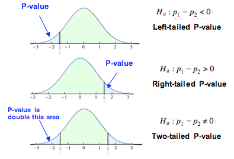

# The p-value: one-sided and two-sided

<span style="display:block;text-align:center">

</span>
<span style="display:block;text-align:center"><font color="grey">Source: </font>adopted from <a href="https://cdn.analystprep.com/cfa-level-1-exam/wp-content/uploads/2019/08/05104407/page-178.jpg">here</a></span>

## Introduction
If $X$ is a random variable from a normal distribution with mean $\mu$ and standard deviation $\sigma$, its $Z$ score is calculated as follows:
$$
Z = \frac{X-\mu}{\sigma}
$$

For the average of a sample size n from some population with mean $\mu$ and standard deviation $\sigma$, the standard error is
$$
s = \frac{\sigma}{\sqrt{n}}
$$
and the $Z$ score is defined as:
$$
Z = \frac{\bar{X}-\mu}{s} = \frac{\bar{X}-\mu}{\sigma / \sqrt{n}}
$$

One typical $Z$ table is the cumulative from mean which gives a probability that a statistic is between 0 and $Z$. Mathematically,
$$
F(z) = \Phi(z) - \frac{1}{2} = {\frac {1}{\sqrt {2\pi }}}\int _{-\infty }^{z}e^{-t^{2}/2}\,dt - \frac{1}{2}
$$

A $Z$ score table is provided [here][ZScoreTable]. 


## Question
The code snippet below loads the $Z$ score table from [wiki page][ZScoreTable] into kdb.

```q
normalTable:(
  (0.0;0.00000 0.00399 0.00798 0.01197 0.01595 0.01994 0.02392 0.02790 0.03188 0.03586);
  (0.1;0.03983 0.04380 0.04776 0.05172 0.05567 0.05962 0.06356 0.06749 0.07142 0.07535);
  (0.2;0.07926 0.08317 0.08706 0.09095 0.09483 0.09871 0.10257 0.10642 0.11026 0.11409);
  (0.3;0.11791 0.12172 0.12552 0.12930 0.13307 0.13683 0.14058 0.14431 0.14803 0.15173);
  (0.4;0.15542 0.15910 0.16276 0.16640 0.17003 0.17364 0.17724 0.18082 0.18439 0.18793);
  (0.5;0.19146 0.19497 0.19847 0.20194 0.20540 0.20884 0.21226 0.21566 0.21904 0.22240);
  (0.6;0.22575 0.22907 0.23237 0.23565 0.23891 0.24215 0.24537 0.24857 0.25175 0.25490);
  (0.7;0.25804 0.26115 0.26424 0.26730 0.27035 0.27337 0.27637 0.27935 0.28230 0.28524);
  (0.8;0.28814 0.29103 0.29389 0.29673 0.29955 0.30234 0.30511 0.30785 0.31057 0.31327);
  (0.9;0.31594 0.31859 0.32121 0.32381 0.32639 0.32894 0.33147 0.33398 0.33646 0.33891);
  (1.0;0.34134 0.34375 0.34614 0.34849 0.35083 0.35314 0.35543 0.35769 0.35993 0.36214);
  (1.1;0.36433 0.36650 0.36864 0.37076 0.37286 0.37493 0.37698 0.37900 0.38100 0.38298);
  (1.2;0.38493 0.38686 0.38877 0.39065 0.39251 0.39435 0.39617 0.39796 0.39973 0.40147);
  (1.3;0.40320 0.40490 0.40658 0.40824 0.40988 0.41149 0.41308 0.41466 0.41621 0.41774);
  (1.4;0.41924 0.42073 0.42220 0.42364 0.42507 0.42647 0.42785 0.42922 0.43056 0.43189);
  (1.5;0.43319 0.43448 0.43574 0.43699 0.43822 0.43943 0.44062 0.44179 0.44295 0.44408);
  (1.6;0.44520 0.44630 0.44738 0.44845 0.44950 0.45053 0.45154 0.45254 0.45352 0.45449);
  (1.7;0.45543 0.45637 0.45728 0.45818 0.45907 0.45994 0.46080 0.46164 0.46246 0.46327);
  (1.8;0.46407 0.46485 0.46562 0.46638 0.46712 0.46784 0.46856 0.46926 0.46995 0.47062);
  (1.9;0.47128 0.47193 0.47257 0.47320 0.47381 0.47441 0.47500 0.47558 0.47615 0.47670);
  (2.0;0.47725 0.47778 0.47831 0.47882 0.47932 0.47982 0.48030 0.48077 0.48124 0.48169);
  (2.1;0.48214 0.48257 0.48300 0.48341 0.48382 0.48422 0.48461 0.48500 0.48537 0.48574);
  (2.2;0.48610 0.48645 0.48679 0.48713 0.48745 0.48778 0.48809 0.48840 0.48870 0.48899);
  (2.3;0.48928 0.48956 0.48983 0.49010 0.49036 0.49061 0.49086 0.49111 0.49134 0.49158);
  (2.4;0.49180 0.49202 0.49224 0.49245 0.49266 0.49286 0.49305 0.49324 0.49343 0.49361);
  (2.5;0.49379 0.49396 0.49413 0.49430 0.49446 0.49461 0.49477 0.49492 0.49506 0.49520);
  (2.6;0.49534 0.49547 0.49560 0.49573 0.49585 0.49598 0.49609 0.49621 0.49632 0.49643);
  (2.7;0.49653 0.49664 0.49674 0.49683 0.49693 0.49702 0.49711 0.49720 0.49728 0.49736);
  (2.8;0.49744 0.49752 0.49760 0.49767 0.49774 0.49781 0.49788 0.49795 0.49801 0.49807);
  (2.9;0.49813 0.49819 0.49825 0.49831 0.49836 0.49841 0.49846 0.49851 0.49856 0.49861);
  (3.0;0.49865 0.49869 0.49874 0.49878 0.49882 0.49886 0.49889 0.49893 0.49896 0.49900);
  (3.1;0.49903 0.49906 0.49910 0.49913 0.49916 0.49918 0.49921 0.49924 0.49926 0.49929);
  (3.2;0.49931 0.49934 0.49936 0.49938 0.49940 0.49942 0.49944 0.49946 0.49948 0.49950);
  (3.3;0.49952 0.49953 0.49955 0.49957 0.49958 0.49960 0.49961 0.49962 0.49964 0.49965);
  (3.4;0.49966 0.49968 0.49969 0.49970 0.49971 0.49972 0.49973 0.49974 0.49975 0.49976);
  (3.5;0.49977 0.49978 0.49978 0.49979 0.49980 0.49981 0.49981 0.49982 0.49983 0.49983);
  (3.6;0.49984 0.49985 0.49985 0.49986 0.49986 0.49987 0.49987 0.49988 0.49988 0.49989);
  (3.7;0.49989 0.49990 0.49990 0.49990 0.49991 0.49991 0.49992 0.49992 0.49992 0.49992);
  (3.8;0.49993 0.49993 0.49993 0.49994 0.49994 0.49994 0.49994 0.49995 0.49995 0.49995);
  (3.9;0.49995 0.49995 0.49996 0.49996 0.49996 0.49996 0.49996 0.49996 0.49997 0.49997);
  (4.0;0.49997 0.49997 0.49997 0.49997 0.49997 0.49997 0.49998 0.49998 0.49998 0.49998)
);

z:raze normalTable[;0]+\:0.01*til 10;
p:raze normalTable[;1];
normTable:(z;p);
```

Implement a function to calculate one-sided or two-sided p value. The function has the following signature:

```q
calcPValue:{[side;z]
  / To be implemented
  };
```
where ``side`` is of type ``symbol`` and can take one of the following values:

- `` `left``: one-sided left hand side test
- `` `right``: one-sided right hand side test
- `` `both``: two-sided test

They correspond to the three hypothesis tests shown in the chart at the very beginning.


[ZScoreTable]: https://en.wikipedia.org/wiki/Standard_normal_table
