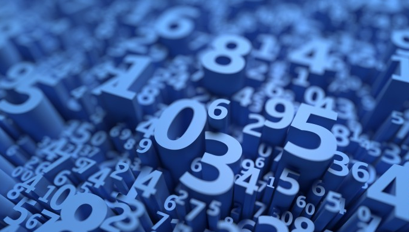

# Random Values

<span style="display:block;text-align:center">

</span>
<span style="display:block;text-align:center"><font color="grey">Source: </font>adopted from <a href="https://www.stevens.edu/sites/stevens_edu/files/styles/news_detail/public/shutterstock_1165123768.jpg?itok=haoBDwhQ">here</a></span>

## Introduction
Any programming language support random number generation, which is required in a Monte Carlo experiment. Arguably, the digits of $\pi$ are good approximates. 

## Question
Create a table with random values compliant with the following schema:

```q
c       | t f a
--------| -----
timespan| n
long    | j
float   | f
symbol  | s	
```
