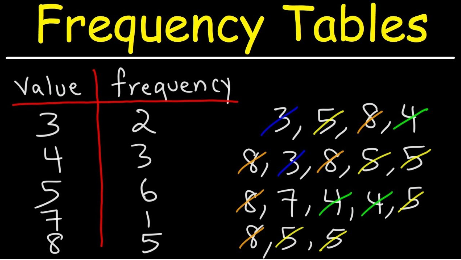

# Frequency Table

<span style="display:block;text-align:center">

</span>
<span style="display:block;text-align:center"><font color="grey">Source: </font>adopted from <a href="https://i.ytimg.com/vi/lyRbCwDDnJo/maxresdefault.jpg">here</a></span>

## Introduction
Frequency refers to the number of times an event or a value occurs. A frequency table is a table that lists values, as well as the number of times each value appears in the data set. A histogram is can be built from a frequency table by aggregating over a specified ranges of continuous data values and corresponding number of frequencies.

## Question
Write a function (``freq``) to calculate the frequency table of a list of integer numbers and sort the key values in ascending order.

```q
system "S -314159";
nums:10000?10;
```

Calling the function against the above list of random integers yields:

```q
q) show freq nums
0| 1008
1| 988
2| 969
3| 1054
4| 977
5| 986
6| 1004
7| 1029
8| 977
9| 1008
```
